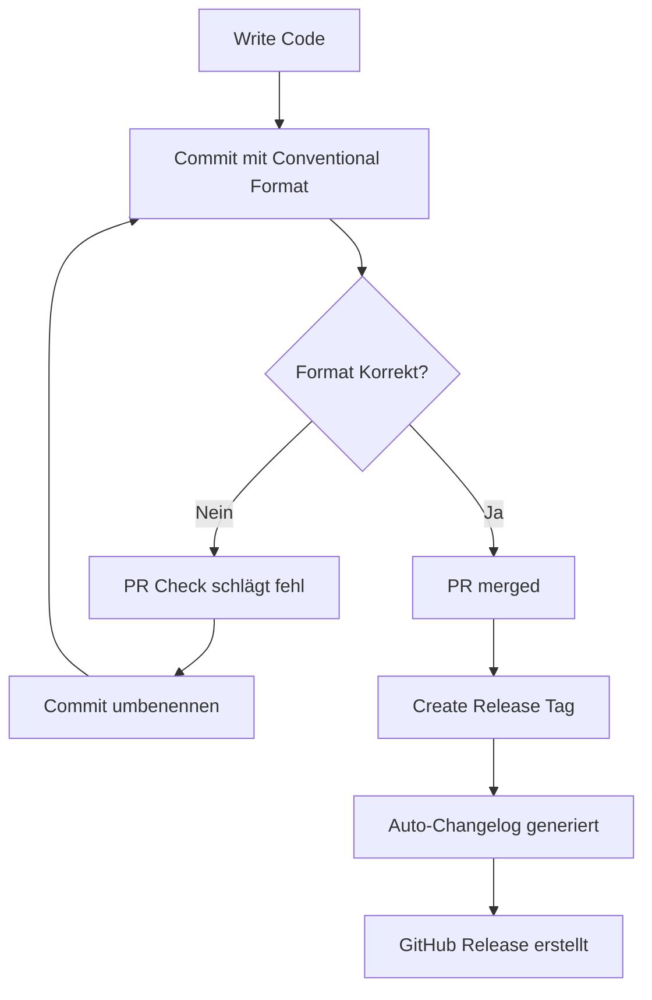

# Conventional Commits Guide

## 📝 Warum?

**Conventional Commits** ermöglichen:
- ✅ **Auto-Changelog**: Release Notes aus Commits generiert
- ✅ **Semantic Versioning**: `feat` = Minor, `fix` = Patch, `BREAKING:` = Major
- ✅ **Bessere History**: Commits sind durchsuchbar nach Typ
- ✅ **CI/CD Integration**: Automatische Releases

---

## 🎯 Format

```
<type>(<scope>): <subject>

[optional body]

[optional footer]
```

### **Type** (PFLICHT):
- `feat` - Neue Funktion (↑ Minor Version)
- `fix` - Bugfix (↑ Patch Version)
- `docs` - Nur Dokumentation
- `style` - Formatierung (kein Code-Change)
- `refactor` - Code-Refactoring (keine Feature/Fix)
- `perf` - Performance-Verbesserung
- `test` - Tests hinzufügen/ändern
- `build` - Build-System (npm, Docker, etc.)
- `ci` - CI/CD Workflows
- `chore` - Maintenance (Dependencies, etc.)
- `revert` - Commit rückgängig machen

### **Scope** (optional):
Bereich der Änderung:
- `devices` - Device Discovery/Management
- `api` - REST API Endpoints
- `frontend` - React UI
- `backend` - Python Backend
- `docker` - Docker/Container
- `workflow` - GitHub Actions

### **Subject** (PFLICHT):
- Kurze Beschreibung (max. 50 Zeichen)
- Lowercase (außer Eigennamen)
- Kein Punkt am Ende
- Imperativ ("add" nicht "added")

### **Body** (optional):
- Detaillierte Beschreibung
- Warum die Änderung?
- Was wurde geändert?

### **Footer** (optional):
- `BREAKING CHANGE:` für Breaking Changes (↑ Major Version)
- `Fixes #123` für Issue-Referenzen
- `Co-authored-by:` für Co-Autoren

---

## ✅ Gute Beispiele

```bash
# Feature hinzufügen
feat(devices): add SSDP auto-discovery

Implements UPnP device discovery using multicast requests.
Devices are cached for 10 minutes to reduce network load.

Fixes #42

# Bugfix
fix(api): handle null response in device sync

Previously crashed when device returned empty response.
Now returns 404 with proper error message.

# Performance
perf(docker): optimize arm64 build time

Switch to platform-specific rollup binaries reduces
build time from 30min to 10min on ARM64 QEMU.

# Breaking Change
feat(api)!: change device ID format to UUIDs

BREAKING CHANGE: Device IDs changed from MAC addresses to UUIDs.
Clients must migrate existing device references.

Migration: GET /api/devices returns new IDs.

# Dokumentation
docs(readme): add Codecov setup instructions

# Test
test(backend): add regression test for XML namespace bug

# CI/CD
ci(workflow): add security scanning with bandit

# Dependency Update
chore(deps): update fastapi to 0.110.0
```

---

## ❌ Schlechte Beispiele

```bash
# ❌ Kein Type
Updated README

# ❌ Type in Uppercase
FEAT: add discovery

# ❌ Punkt am Ende
feat: add discovery.

# ❌ Nicht imperativ
feat: added discovery

# ❌ Zu lang (>72 Zeichen)
feat(devices): add SSDP auto-discovery feature with caching and timeout handling

# ❌ Zu vage
fix: bug
chore: stuff
feat: changes

# ✅ BESSER
feat(devices): add SSDP auto-discovery
fix(api): handle null device response
chore(deps): update fastapi to 0.110.0
```

---

## 🛠️ Tools & Validierung

### **1. Automatische Validierung (Pull Requests)**

Der Workflow `.github/workflows/commitlint.yml` prüft:
- ✅ PR Title muss Conventional Commits folgen
- ✅ Alle Commits in PR müssen valide sein
- ❌ PR wird blockiert bei ungültigen Commits

### **2. Lokale Validierung (optional)**

Install commitlint lokal:
```bash
npm install -g @commitlint/cli @commitlint/config-conventional

# Commit Message testen
echo "feat(devices): add discovery" | commitlint

# Letzten Commit validieren
git log -1 --pretty=format:"%s" | commitlint
```

### **3. Git Hooks (optional)**

Automatisch bei jedem Commit prüfen:
```bash
# Install husky + commitlint
npm install --save-dev @commitlint/cli @commitlint/config-conventional husky

# Setup hook
npx husky install
npx husky add .husky/commit-msg 'npx commitlint --edit $1'
```

---

## 🔧 Commits nachträglich reparieren

### **Letzten Commit umbenennen:**
```bash
git commit --amend -m "feat(devices): add SSDP discovery"
git push --force-with-lease
```

### **Mehrere Commits umbenennen:**
```bash
# Interaktives Rebase (z.B. letzte 3 Commits)
git rebase -i HEAD~3

# Editor öffnet sich:
# Ändere "pick" zu "reword" bei Commits die du ändern willst
# Speichern & Schließen

# Für jeden "reword" Commit öffnet sich Editor
# → Neue Commit-Message eingeben im Conventional Format

# Force push
git push --force-with-lease
```

### **Squash mehrerer Commits:**
```bash
git rebase -i HEAD~5

# Ändere alle außer erstem zu "squash"
# Schreibe eine neue Conventional Commit Message
git push --force-with-lease
```

---

## 📊 Impact auf Releases

### **Semantic Versioning:**
```
feat:      → v1.1.0 (Minor ↑)
fix:       → v1.0.1 (Patch ↑)
BREAKING:  → v2.0.0 (Major ↑)
docs/test: → v1.0.0 (keine Änderung)
```

### **Changelog Generation:**

Bei Release `v1.2.0` werden Commits gruppiert:

```markdown
## 🚀 Features
- feat(devices): add SSDP auto-discovery (#42)
- feat(api): add manual device registration

## 🐛 Bug Fixes
- fix(api): handle null response in device sync
- fix(docker): resolve ARM64 build timeout

## 📚 Documentation
- docs(readme): add Codecov setup guide

## ⚡ Performance
- perf(docker): optimize ARM64 build time

## 🔧 Maintenance
- chore(deps): update fastapi to 0.110.0
- ci(workflow): add security scanning
```

---

## 🎓 Best Practices

1. **Ein Commit = Ein logischer Change**
   - ✅ `feat(api): add device endpoint`
   - ❌ `feat: add endpoint, fix bug, update docs` (3 Commits!)

2. **Commit Messages sind Dokumentation**
   - Subject: **Was** wurde gemacht?
   - Body: **Warum** wurde es gemacht?

3. **Scope nutzen**
   - Hilft beim Filtern: `git log --grep="^feat(devices)"`
   - Zeigt betroffenen Bereich im Changelog

4. **Breaking Changes markieren**
   - `feat!:` oder `BREAKING CHANGE:` in Footer
   - User müssen wissen dass Update Breaking ist

5. **Issue-Referenzen**
   - `Fixes #123` schließt Issue automatisch
   - `Refs #42` verlinkt nur

---

## 📖 Weitere Resourcen

- **Spec**: https://www.conventionalcommits.org/
- **Commitlint Docs**: https://commitlint.js.org/
- **Semantic Versioning**: https://semver.org/
- **Conventional Changelog**: https://github.com/conventional-changelog/conventional-changelog

---

## ✅ Workflow Summary



---

**Happy Committing!** 🎉
